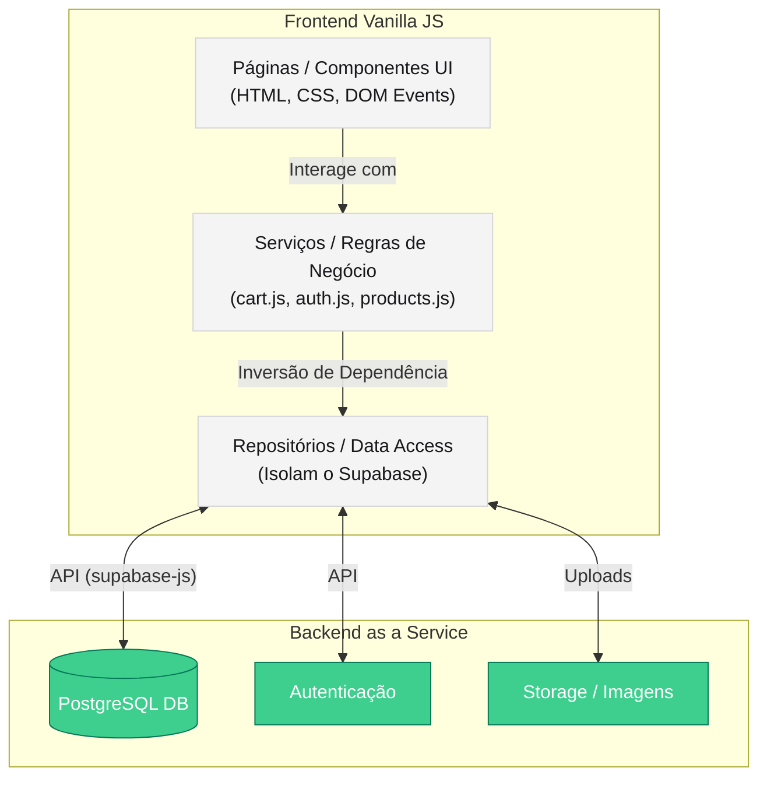

# 🛍️ Loja de Produtos - E-Commerce Sustentável e Moderno

Um sistema de E-Commerce completo, minimalista e de alta performance desenvolvido inteiramente com **Vanilla JS**, Focado em experiência premium (UI/UX) e carregamento instantâneo. Nascido da necessidade de ter um portal rápido, o ecossistema une beleza visual à estabilidade arquitetural de backend-ass-a-service (BaaS) usando Supabase.

[](#)
[](#)

---

## 🎨 O Projeto
A interface da **Loja VIRTUS** adere rigorosamente aos princípios de design de *Glassmorphism*, paletas monocromáticas escuras com contrastes vivos (`hsl(var(--accent-color))`), micro-animações dinâmicas e **total responsividade** desde Desktops 4K até os menores smartphones, permitindo tanto que o cliente compre com prazer, quanto o administrador gerencie todo o sistema utilizando apenas os polegares na tela.

### 🌟 Pilares da Experiência
1. **Premium Aesthetics:** Cores vibrantes, sombras difusas e componentes que reagem fisicamente (escala e botões de brilho) à interação do usuário.  
2. **"Single Page" Vibe:** Transições de views feitas via manipulação estrita do DOM, sem reloads (exceto ao finalizar auth para purgar sessões antigas de memória). 
3. **Responsive & Paginated by Default:** Cada tabela administrativa e grid de compras é adaptável; de grades massivas na web a fichas (Cards) na tela de celular, agora operando com **Paginação Flexível** (de 5 a 10 itens por view) para o máximo de performance com o mínimo de confusão visual, mesmo lidando com milhares de registros de vendas.

---

## 🛠️ Stack Tecnológica

* **Frontend Engine:** Vanilla JavaScript Puro (ESM Modules). 
* **Marcação e Estilo:** Semantic HTML5 & CSS3 Avançado (Flex, Grid, CSS Variables nativas `hsl` e media queries severas). Sem Bootstrap ou Tailwind para máximo controle de cada pixel renderizado na tela.
* **Componentização UI/UX:** `Flatpickr` (Selecionador inteligente de datas em relatórios gerenciais na Dashboard PT-BR) e `ApexCharts` para o Mix de Vendas.
* **Backend, Auth & Database:** [Supabase](https://supabase.com) (PostgreSQL gerenciado). Autenticação, Row-Level-Security (RLS), Edge Functions, Webhooks SMTP e Storage Básico de assets.
* **Build Tool:** Vite, configurado no motor ultra-rapide para bundling de produção visando distribuição nativa (`dist/`) com base para subdiretórios Apache. `npm run build` cria versão estática optimizada para Apache/Hostgator.

---

## 🏗️ Estrutura de Pastas e Arquitetura do Frontend

O projeto adere uma hierarquia estrita focada em **Módulos Limpos (Clean Modules)**. Os arquivos de regras de negócio (Serviços) nunca misturam os de Views (Páginas/Modalidades) e seguem **Princípios SOLID** (Single Responsibility e Dependency Inversion), concentrando acesso direto ao backend em uma camada de Repositórios dedicada:

### Diagrama de Arquitetura (SOLID)



### Estrutura de Diretórios

```text
/
├── dist/                # Bundle pronto de produção minificado e hasheado gerado pelo Vite. 
├── src/                 # Todo código fonte livre Vanilla.
│   ├── components/      # Pedacinhos de HTML importados e gerenciáveis via DOM.
│   │   ├── modals/      # Auth, Gallery, Product-Admin Injectors.
│   │   ├── footers/     # Rodapé com Links Úteis, Contatos.
│   │   └── headers/     # Header (Nav-bars), Carrinho Dinâmico (Sidebar).
│   ├── lib/             # Scripts 3rd-party ou Engines de conexão (ex: Instância isolada do Supabase).
│   ├── pages/           # Seções massivas do Sistema.
│   │   ├── dashboard.html # Template do Painel de Admin/Meu Perfil com Injections via JS.
│   │   ├── store.html     # Template da vitrine com Grade principal.
│   │   └── boleto-template.html # Molde de impressão PDF de boleto simulado para clientes.
│   ├── repositories/    # Camada de Acesso a Dados isolada (DIP). Encapsula chamadas cruas SQL/Supabase.
│   ├── services/        # 🧠 O Cérebro JS. Onde acontecem chamadas de negócio abstratas, injetando interfaces do Repositório.
│   │   ├── auth.js      # Lidando c/ Session Tokens & Flow de Boas Vindas Restrito.
│   │   ├── cart.js      # Cache Local via LocalStorage, Checkout, geração de Boleto.
│   │   ├── orders.js    # Fetch MyOrders, Generate Admin Orders e Relatórios Precisos (Bypass de Pendentes).
│   │   ├── products.js  # CRUD de Produtos delegados aos Repositórios, Kardex(Estoque), listagem. 
│   │   └── profile.js   # Controle de Meus Dados Pessoais / Endereço Obrigatório p/ Checkout.
│   ├── ui/              # Handlers UI para Dialogos modais customizados que o navegador não faz.
│   ├── main.js          # Cola de Injeção. Sabe como inicializar os modulos injetando todo o HTML assincronamente no body.
│   └── style.css        # Todas Variáveis CSS mestres de Token do Design System. 
├── index.html           # Root Container e ponto de montagem do Vite.
└── vite.config.js       # Regras de build.
```


---

## 🚀 Funcionalidades Chaves (Core Features)

### Para o Comprador 🛒:
- **Catálogo Responsivo** com Filtros Laterais Inteligentes e Busca em tempo Real "Ver Todos".
- **Carrinho de Compras** em modal persistente (usando LocalStorage, não perca nunca seus itens recarregando a página).
- **Perfis com Cadastro Obrigatório Inteligente:** O checkout intercepta clientes e os bloqueia de finalizar a compra se eles não tiverem um Telefone e um CEP configurados, guiando-os ao Dashboard suavemente para completar a conta.
- **Gateway Gateway com Boleto Simulado:** Geração realística de boleto em PDF com data de vencimento calculada, trava contra finais de semana, cálculo de mora/multa e simulação de código de barras pagável gerado restritamente por autenticação.
- **Minhas Compras:** Rastreamento do histórico visual organizado em páginas curtas de 5 itens para Mobile-first efficiency.

### Para o Administrador/Vendedor 👑:
- **Tabelas de Gestão Paginadas:** Clientes, Kardex, Vendas e Catálogo operam sob uma matriz de Paginação Frontend inteligente. A busca varre todo o array do catálogo e redesenha sua página instantaneamente aos milhares. Nenhuma tabela "quebra" a tela ou cria scrolls de milhares de pixels num celular.
- **Relatório de Funil Financeiro de Extrema Precisão:** Acesso na Dashboard a Receitas Brutas com filtros por Range de Datas. O Gráfico "Mix de Vendas" possui exclusão inteligente: ele retira sumariamente qualquer pedido faturado que ainda esteja constando como "Cancelado" ou "Pendente" (Aguardando pagode) no banco de dados. Você só enxerga fatias de itens onde o dinheiro já pingou na conta.
- **Gestão Simplificada do Catálogo** com possibilidade extra: **Inclusão do Preço de Custo Oculto** do seu estoque, que o cliente não vê. Permite ao gerente visualizar o ROI facilmente. 
- Atualização unitária de status rápida com devolução automática do produto cancelado para o fluxo do Estoque do sistema, reativando a reposição sem intervenção.

---

## 🖥️ Como Executar Localmente (Development)

Siga os passos a seguir usando o Node.js em seu terminal Root. O projeto deve possuir um arquivo `.env` mapeando devidamente para uma base do Supabase com todas as tabelas e schemas presentes nas regras de negócio da pasta de Skills:

1. Clone o projeto e instale os pacotes:
```bash
npm install
```

2. Popule o respectivo arquivo `.env` com a url rest/DB do `Supabase` para desenvolvimento:
```bash
VITE_SUPABASE_URL=sua_url_aqui
VITE_SUPABASE_ANON_KEY=sua_secret_aqui
```
*(Nota Técnica: O Vite usa o prefixo estrito `VITE_` para expor variáveis de build na web).*

3. Suba o servidor do HMR (Hot-Module-Replacement):
```bash
npm run dev
```
*(Seu browser local abrirá instantaneamente em http://localhost:5173).*

---

## 🔒 Segurança (RLS e Supabase)

Toda manipulação sensível no banco (como deletar ou apagar produtos, ler Relatórios de Gestão, ou gerar visualizações de boletos .html alheios) dependem das `Row Level Security (RLS) policies` ativas no Supabase. Modos de **Admin e Vendedor** controlam o painel, não via Frontend JS hackeáveis, mas pelo Schema restrito associado aos Tokens de Oauth emitidos pelo banco de dados aos Perfis corretos da Loja, validando JWT secretamente! 

O arquivo `services/auth.js` gerencia as sessões persistentes com base neste fluxo restritivo e inteligente (Redirecionando usuários de completude em completude). Dependendo da sua role informada, até a tabela de Produtos retorna informações exclusivas baseadas em seu JWT.
