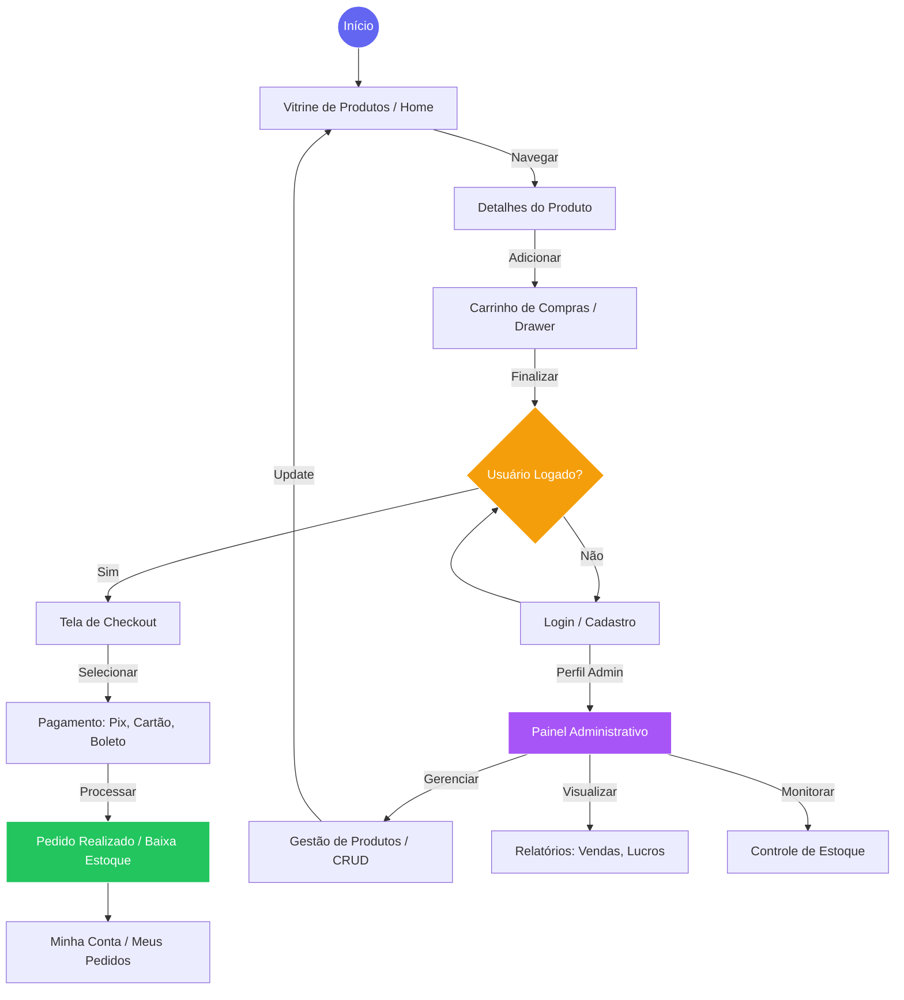

# Fluxo do Sistema - Loja de Produtos

Este documento detalha o fluxo de navegação, processos de negócio e integração de dados do sistema.

## 1. Diagrama de Fluxo Geral

Abaixo, o diagrama que ilustra a jornada do Comprador e as ações administrativas.

## 2. Fluxo de Dados (Arquitetura Técnica)

O sistema utiliza uma arquitetura **Serverless** com Supabase:

1.  **Requisição:** O usuário interage com a UI (Vanilla JS).
2.  **Lógica:** O `src/services/` valida as regras de negócio localmente.
3.  **Persistência:** O Cliente Supabase envia os dados para o PostgreSQL.
4.  **Segurança:** As políticas de **RLS (Row Level Security)** no banco garantem que:
    *   Compradores vejam apenas seus próprios pedidos.
    *   Visitantes apenas leiam o catálogo.
    *   Apenas Administradores/Vendedores gerenciem produtos.

## 3. Estados do Pedido

O ciclo de vida de uma venda segue os estados:
`Pendente` ➔ `Pago` ➔ `Enviado` ➔ `Entregue` (ou `Cancelado`).

---
*Nota: Para visualizar o diagrama acima, utilize uma extensão de visualização de Markdown com suporte a Mermaid no VS Code.*
