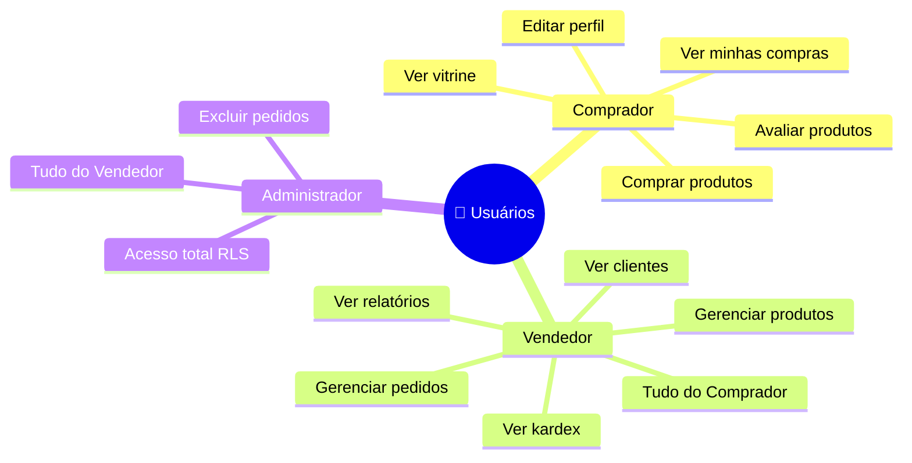
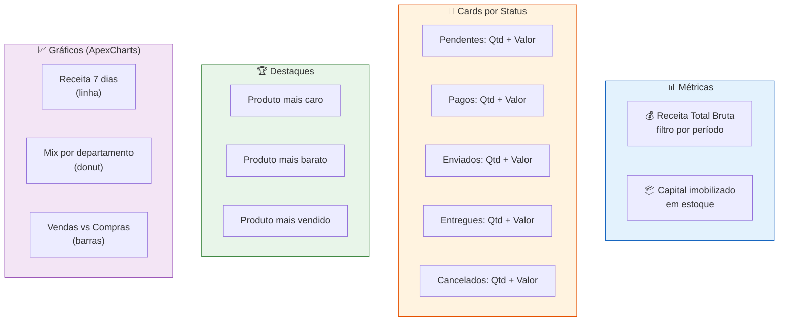
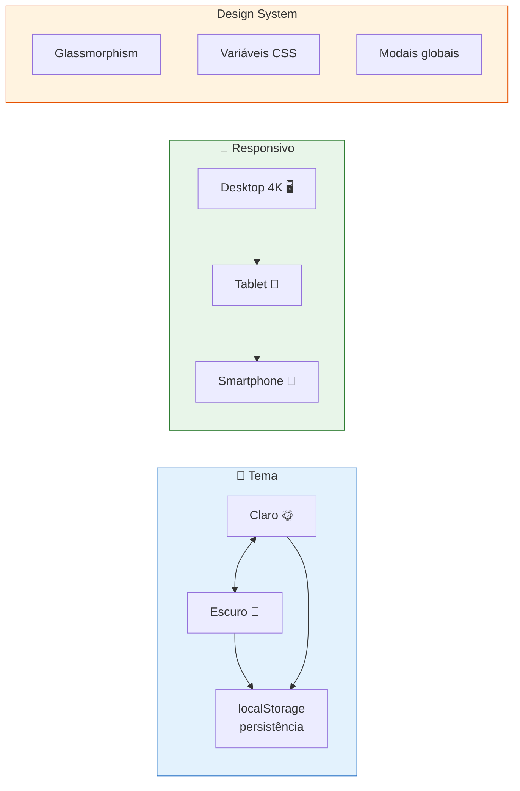
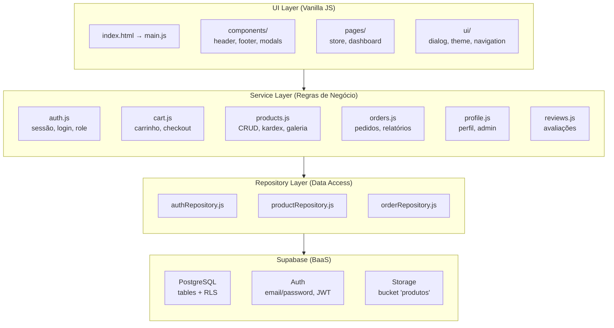
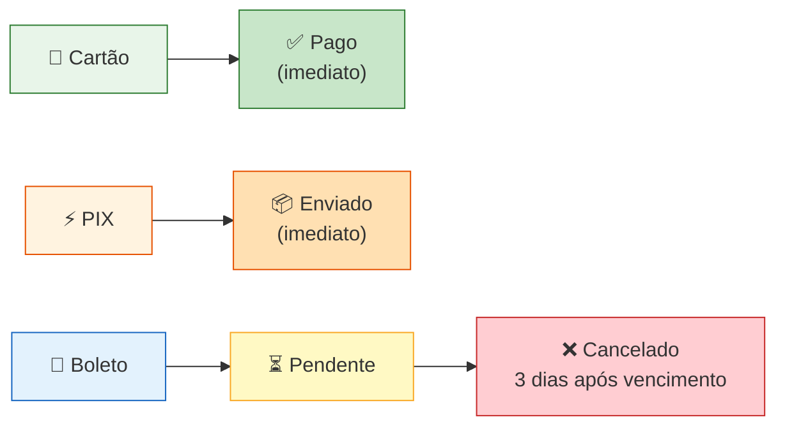
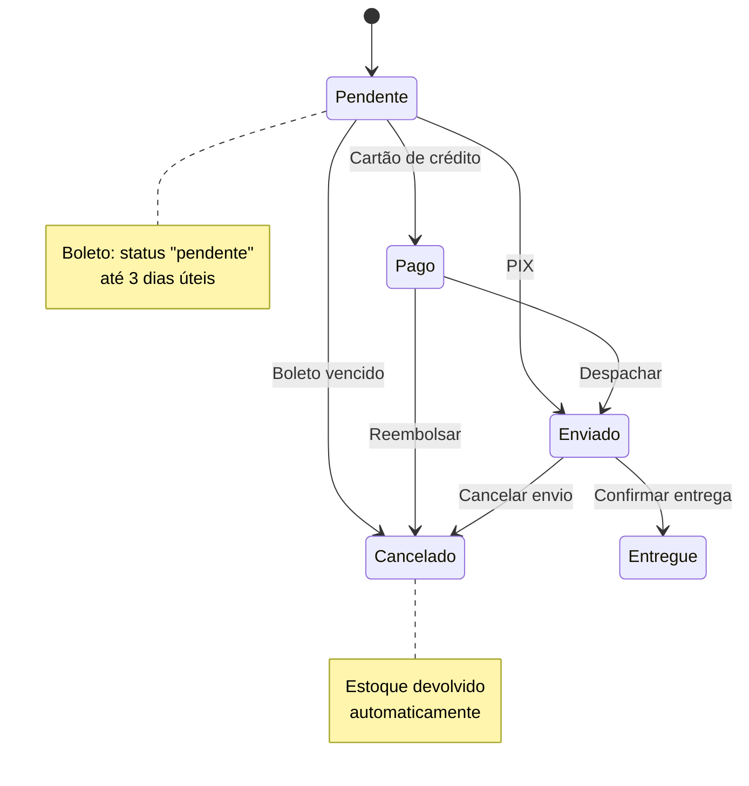
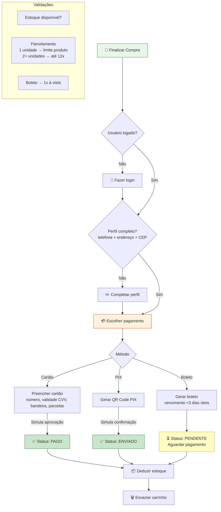
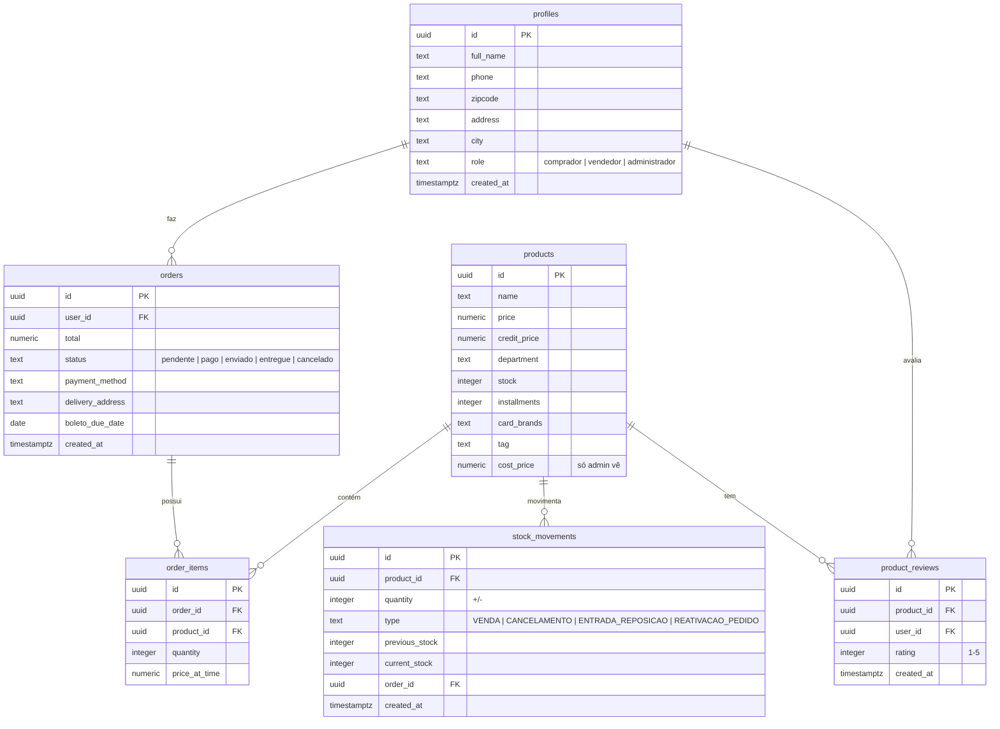
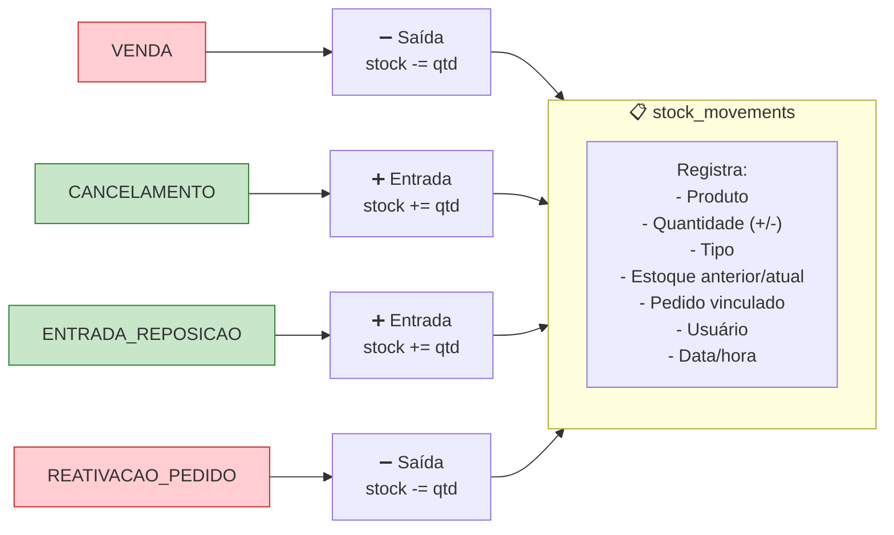
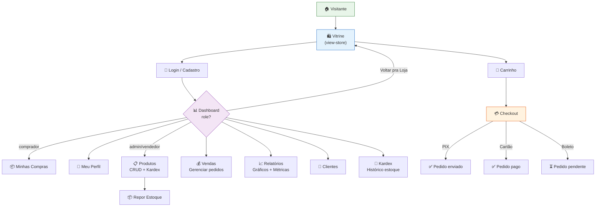

# Spec-Driven Development — Loja Virtus (E-Commerce)

## 1. Visão Geral

**Produto:** Loja Virtus — E-commerce completo para venda de vestuário, acessórios, perfumaria e cosméticos.

**Stack:** Vanilla JS (ES Modules) + Vite + Supabase (PostgreSQL, Auth, Storage, RLS)

**Arquitetura:** SPA com camadas SOLID — UI → Services (regras de negócio) → Repositories (acesso a dados)

### Perfis de Usuário



---

## 2. Requisitos Funcionais (RF)

### Módulo: Autenticação e Perfil

| ID | Descrição | Prioridade |
|---|---|---|
| RF-01 | Visitante pode criar conta com nome, e-mail e senha | Alta |
| RF-02 | Usuário pode fazer login com e-mail + senha | Alta |
| RF-03 | Usuário pode recuperar senha via Supabase (e-mail) | Média |
| RF-04 | Usuário logado pode editar perfil (nome, telefone, CEP, endereço, cidade) | Alta |
| RF-05 | Perfil criado automaticamente ao cadastrar via trigger no banco (role padrão: `comprador`) | Alta |
| RF-06 | Sistema reconhece 3 roles: `comprador`, `vendedor`, `administrador` | Alta |
| RF-07 | Admin/Vendedor veem painel administrativo; comprador só vê perfil e minhas compras | Alta |
| RF-08 | Botão "Sair" faz logout e redireciona para raiz | Média |

### Módulo: Catálogo de Produtos

| ID | Descrição | Prioridade |
|---|---|---|
| RF-09 | Vitrine exibe grid de produtos com imagem, nome, categoria, preço, tag, nota e botão "Comprar" | Alta |
| RF-10 | Filtro por departamento: `todos`, `vestuario`, `acessorios`, `perfumaria`, `cosmeticos` | Alta |
| RF-11 | Filtro por tag (ex: "Oferta", "Novo", "Destaque") | Média |
| RF-12 | Produto sem estoque aparece com overlay "Esgotado" e botão desabilitado | Alta |
| RF-13 | Galeria de imagens com zoom (mouse hover) e miniaturas clicáveis | Média |
| RF-14 | Sistema de avaliação por estrelas (1-5): usuário logado pode avaliar uma vez por produto | Média |
| RF-15 | Média das avaliações aparece no card do produto | Média |

### Módulo: Carrinho

| ID | Descrição | Prioridade |
|---|---|---|
| RF-16 | Carrinho em drawer lateral com itens, quantidades, controles +/- e remover item | Alta |
| RF-17 | Carrinho é volátil (array em memória, não localStorage) | Média |
| RF-18 | Botão "Comprar" no card adiciona 1 unidade ao carrinho | Alta |
| RF-19 | Validação de estoque: impede adicionar mais que o disponível | Alta |
| RF-20 | Badge no header mostra total de itens no carrinho com animação pulse | Média |

### Módulo: Checkout

| ID | Descrição | Prioridade |
|---|---|---|
| RF-21 | Checkout exige: usuário logado + telefone + endereço + CEP preenchidos | Alta |
| RF-22 | Formulário de endereço: CEP (com máscara), endereço, cidade | Alta |
| RF-23 | 3 métodos de pagamento: `cartao_credito`, `pix`, `boleto` | Alta |
| RF-24 | Cartão de crédito: campos com máscara (número, validade MM/AA, CVV), bandeiras permitidas, parcelamento | Alta |
| RF-25 | Parcelamento: 1 produto → limite do produto; 2+ unidades → até 12x; boleto → 1x | Alta |
| RF-26 | Preço diferente para crédito (`credit_price`) e à vista (`price`) | Média |
| RF-27 | Boleto: gera data de vencimento (+3 dias úteis), código de barras simulado, abre PDF para impressão | Alta |
| RF-28 | Boleto salva dados no `localStorage` para impressão em template separado | Média |
| RF-29 | PIX: status vai direto para "enviado" (simulação) | Média |
| RF-30 | Cartão: status vai direto para "pago" (simulação) | Média |
| RF-31 | Boleto: status fica "pendente", cancelado automaticamente após 3 dias vencido (função DB) | Alta |

### Módulo: Pedidos (Comprador)

| ID | Descrição | Prioridade |
|---|---|---|
| RF-32 | "Minhas Compras": tabela paginada (5 itens/página) com número, data, endereço, status, total | Alta |
| RF-33 | Modal de detalhes do pedido com itens (foto, nome, qtd, preço unit., subtotal) | Média |
| RF-34 | Cores de status: pendente (laranja), pago (azul), enviado (roxo), entregue (verde), cancelado (vermelho) | Média |

### Módulo: Admin — Produtos

| ID | Descrição | Prioridade |
|---|---|---|
| RF-35 | CRUD de produtos: nome, descrição, preço, preço crédito, custo, departamento, gênero, estoque, parcelas, bandeiras, tag, imagens | Alta |
| RF-36 | Upload de imagens comprimidas (WebP) para Supabase Storage (máx 4 fotos) | Alta |
| RF-37 | Máscara de moeda brasileira (R$ 1.234,56) nos inputs de preço | Alta |
| RF-38 | Tabela paginada (10/página) com busca por nome | Alta |
| RF-39 | Reposição de estoque: adicionar quantidade + atualizar preço de custo | Alta |
| RF-40 | Histórico de movimentação (Kardex) com busca e paginação (10/página) | Alta |
| RF-41 | Tipos de movimentação: VENDA, CANCELAMENTO, ENTRADA_REPOSICAO, REATIVACAO_PEDIDO | Alta |
| RF-42 | Skeleton loader na tabela de produtos enquanto carrega | Média |

### Módulo: Admin — Pedidos

| ID | Descrição | Prioridade |
|---|---|---|
| RF-43 | Tabela de vendas paginada (10/página) com cliente, status, total | Alta |
| RF-44 | Dropdown para alterar status do pedido + botão "Atualizar" | Alta |
| RF-45 | Cancelamento devolve itens ao estoque automaticamente | Alta |
| RF-46 | Reativação de pedido cancelado re-deduz estoque | Média |
| RF-47 | Exclusão permanente de pedidos cancelados (com confirmação) | Média |
| RF-48 | Cards de estatísticas: "Caixa Hoje" (soma total de hoje) e "Pedidos Pendentes" (contagem) | Alta |

### Módulo: Admin — Relatórios



| ID | Descrição | Prioridade |
|---|---|---|
| RF-49 | Receita Total Bruta com filtro por período (Flatpickr pt-BR) | Alta |
| RF-50 | Cards por status: quantidade + valor por status | Alta |
| RF-51 | Produto mais caro e mais barato do catálogo | Média |
| RF-52 | Produto mais vendido geral | Média |
| RF-53 | Capital imobilizado em estoque | Baixa |
| RF-54 | Gráficos ApexCharts: receita 7 dias (linha), mix por departamento (donut), vendas vs compras (barras) | Alta |

### Módulo: Admin — Clientes

| ID | Descrição | Prioridade |
|---|---|---|
| RF-55 | Tabela com todos os usuários cadastrados (nome, telefone, CEP, endereço, cidade, role) | Média |

### Módulo: UI/UX



| ID | Descrição | Prioridade |
|---|---|---|
| RF-56 | Tema claro/escuro com persistência em localStorage | Alta |
| RF-57 | Glassmorphism design system com variáveis CSS | Alta |
| RF-58 | Responsivo: desktop 4K até smartphones | Alta |
| RF-59 | Loading overlay na inicialização com fade out | Média |
| RF-60 | Modal de diálogo global (showDialog) para confirmações e alertas | Alta |
| RF-61 | Navegação entre loja e dashboard via botão único | Alta |

---

## 3. Requisitos Não-Funcionais (RNF)

| ID | Descrição | Prioridade |
|---|---|---|
| RNF-01 | Zero dependências de framework JS (Vanilla puro) — exceto libs gráficas | Alta |
| RNF-02 | Build via Vite 5.x com base path `/lojaprodutos/` | Alta |
| RNF-03 | Supabase como única fonte de dados (PostgreSQL + Storage) | Alta |
| RNF-04 | Row-Level Security (RLS) para todas as tabelas | Alta |
| RNF-05 | CORS e políticas de storage restritas por autenticação | Alta |
| RNF-06 | Tempo de carregamento inicial < 3s (otimizado por Vite) | Média |
| RNF-07 | Compatível com Apache (subdiretório via `.htaccess`) | Média |
| RNF-08 | Código modular: UI / Services / Repositories (SOLID) | Alta |

---

## 4. Regras de Negócio (RN)

| ID | Descrição |
|---|---|
| RN-01 | Usuário só finaliza compra se tiver telefone + endereço + CEP no perfil |
| RN-02 | Estoque nunca pode ficar negativo: vendas verificam saldo atual do banco |
| RN-03 | Cancelamento de pedido devolve itens ao estoque com movimento CANCELAMENTO |
| RN-04 | Reativação de pedido cancelado re-deduz estoque com movimento REATIVACAO_PEDIDO |
| RN-05 | Boleto vence em 3 dias úteis; cancelado automaticamente após 3 dias corridos de vencido |
| RN-06 | Preço do cartão (`credit_price`) pode diferir do preço à vista (`price`) |
| RN-07 | Parcelamento: 1 unidade → limitado pelo campo `installments` do produto; 2+ → até 12x |
| RN-08 | Boleto é sempre 1x (à vista) |
| RN-09 | Produto com `stock <= 0` é exibido como "Esgotado" e não pode ser comprado |
| RN-10 | Admin/Vendedor veem `cost_price` (preço de custo); comprador nunca vê |
| RN-11 | Relatórios financeiros excluem pedidos cancelados do cômputo |
| RN-12 | Máximo de 4 imagens por produto no upload |
| RN-13 | Uma avaliação por usuário por produto (chave única `product_id + user_id`) |

---

## 5. Arquitetura do Sistema

### 5.1 Diagrama de Camadas



### 5.2 Tipos de Pagamento e Fluxo de Status



### 5.3 Ciclo de Vida do Pedido



### 5.4 Fluxo de Checkout



---

## 6. Modelo de Dados

### 6.0 Relacionamento entre Tabelas (DER)



### 6.1 `profiles`

| Coluna | Tipo | Restrições |
|---|---|---|
| id | UUID | PK → auth.users(id) ON DELETE CASCADE |
| full_name | TEXT | NOT NULL |
| phone | TEXT | |
| zipcode | TEXT | |
| address | TEXT | |
| city | TEXT | |
| role | TEXT | CHECK IN ('comprador', 'vendedor', 'administrador') DEFAULT 'comprador' |
| created_at | TIMESTAMPTZ | DEFAULT NOW() |
| updated_at | TIMESTAMPTZ | DEFAULT NOW() |

### 6.2 `products`

| Coluna | Tipo | Restrições |
|---|---|---|
| id | UUID | PK DEFAULT gen_random_uuid() |
| name | TEXT | NOT NULL |
| description | TEXT | |
| price | NUMERIC(10,2) | NOT NULL |
| department | TEXT | NOT NULL CHECK ('vestuario','acessorios','perfumaria','cosmeticos') |
| gender | TEXT | CHECK ('masculino','feminino','unissex','infantil') |
| image_url | TEXT | URLs separadas por vírgula |
| stock | INTEGER | DEFAULT 0 |
| credit_price | NUMERIC(10,2) | Preço para cartão |
| installments | INTEGER | DEFAULT 1 |
| card_brands | TEXT | DEFAULT 'VISA, MASTERCARD' |
| tag | TEXT | 'Novo', 'Oferta', 'Destaque', etc. |
| cost_price | NUMERIC(10,2) | Visível apenas admin/vendedor |
| created_at | TIMESTAMPTZ | DEFAULT NOW() |
| updated_at | TIMESTAMPTZ | DEFAULT NOW() |

### 6.3 `orders`

| Coluna | Tipo | Restrições |
|---|---|---|
| id | UUID | PK DEFAULT gen_random_uuid() |
| user_id | UUID | → profiles(id) ON DELETE SET NULL |
| total | NUMERIC(10,2) | NOT NULL |
| status | TEXT | CHECK ('pendente','pago','enviado','entregue','cancelado') DEFAULT 'pendente' |
| payment_method | TEXT | CHECK ('cartao_credito','pix','boleto','deposito_conta') |
| delivery_address | TEXT | |
| boleto_due_date | DATE | |
| boleto_barcode | TEXT | |
| created_at | TIMESTAMPTZ | DEFAULT NOW() |

### 6.4 `order_items`

| Coluna | Tipo | Restrições |
|---|---|---|
| id | UUID | PK DEFAULT gen_random_uuid() |
| order_id | UUID | → orders(id) ON DELETE CASCADE |
| product_id | UUID | → products(id) ON DELETE SET NULL |
| quantity | INTEGER | NOT NULL CHECK (> 0) |
| price_at_time | NUMERIC(10,2) | NOT NULL |

### 6.5 `stock_movements`

| Coluna | Tipo | Restrições |
|---|---|---|
| id | UUID | PK DEFAULT gen_random_uuid() |
| product_id | UUID | → products(id) |
| quantity | INTEGER | Positivo = entrada, Negativo = saída |
| type | TEXT | NOT NULL ('VENDA','CANCELAMENTO','ENTRADA_REPOSICAO','ENTRADA_MANUAL','AJUSTE','REATIVACAO_PEDIDO') |
| previous_stock | INTEGER | |
| current_stock | INTEGER | |
| order_id | UUID | → orders(id) (nullable) |
| user_id | UUID | → auth.users(id) |
| created_at | TIMESTAMPTZ | DEFAULT NOW() |

### 6.6 Fluxo de Movimentação de Estoque (Kardex)



### 6.7 `product_reviews`

| Coluna | Tipo | Restrições |
|---|---|---|
| id | UUID | PK DEFAULT gen_random_uuid() |
| product_id | UUID | → products(id) |
| user_id | UUID | → auth.users(id) |
| rating | INTEGER | CHECK (1-5) |
| created_at | TIMESTAMPTZ | DEFAULT NOW() |
| UNIQUE | (product_id, user_id) | |

---

## 7. Especificação de Rotas (Navegação SPA)

Não há rotas URL — a navegação é feita por exibição/ocultação de views:



| View | Elemento | Trigger |
|---|---|---|
| Vitrine | `#view-store` | Default / "Voltar pra Loja" |
| Dashboard | `#view-dashboard` | Clique no nome do usuário logado |
| Aba Perfil | `#dash-perfil` | Botão no dashboard |
| Aba Compras | `#dash-compras` | Botão no dashboard |
| Aba Admin Produtos | `#dash-produtos` | Botão no dashboard (admin/vendedor) |
| Aba Admin Vendas | `#dash-vendas` | Botão no dashboard (admin/vendedor) |
| Aba Admin Relatórios | `#dash-relatorios` | Botão no dashboard (admin/vendedor) |
| Aba Admin Clientes | `#dash-clientes` | Botão no dashboard (admin/vendedor) |
| Aba Admin Kardex | `#dash-kardex` | Botão no dashboard (admin/vendedor) |

---

## 8. User Stories e Critérios de Aceitação

### US-01: Comprador navega e compra

```
Dado que sou um visitante na vitrine
Quando clico em "Comprar" em um produto com estoque
Então ele é adicionado ao carrinho
E o badge do carrinho atualiza

Dado que tenho itens no carrinho
E estou logado com perfil completo
Quando finalizo a compra via cartão de crédito
Então o pedido é criado com status "pago"
E o estoque é deduzido
E o carrinho é esvaziado
```

### US-02: Admin gerencia estoque

```
Dado que sou administrador
Quando acesso o painel de produtos
E clico em "Repor" em um produto
E informo quantidade e novo preço de custo
Então o estoque é incrementado
E o movimento é registrado no Kardex
```

### US-03: Cancelamento devolve estoque

```
Dado que sou administrador
Quando mudo o status de um pedido para "cancelado"
Então todos os itens retornam ao estoque
E um movimento CANCELAMENTO é registrado
E o estoque final reflete a devolução
```

### US-04: Boleto vencido é cancelado

```
Dado que um boleto está pendente há mais de 3 dias após o vencimento
Quando a função cancel_expired_boletos() é executada
Então o pedido muda para "cancelado"
E os itens retornam ao estoque
```

---

## 9. Estrutura de Arquivos (Spec)

```
/ (raiz)
├── index.html                    # Ponto de entrada SPA
├── src/
│   ├── main.js                   # Orquestrador: monta HTML + inicializa módulos
│   ├── style.css                 # Design system (variáveis CSS, glassmorphism)
│   ├── charts.js                 # ApexCharts: 3 gráficos do dashboard
│   ├── lib/
│   │   └── supabase.js           # Singleton do cliente Supabase
│   ├── components/
│   │   ├── header.html           # Nav superior: logo, categorias, tema, login, carrinho
│   │   ├── footer.html           # Rodapé simples com copyright
│   │   └── modals/
│   │       ├── auth.html         # Login / Cadastro
│   │       ├── cart.html         # Drawer do carrinho
│   │       ├── checkout.html     # Checkout completo
│   │       ├── dialog.html       # Modal de diálogo genérico
│   │       ├── gallery.html      # Galeria com zoom + avaliação
│   │       ├── product-admin.html # Formulário de produto (add/edit)
│   │       └── restock.html      # Modal de reposição de estoque
│   ├── pages/
│   │   ├── store.html            # Vitrine: hero + grid de produtos
│   │   └── dashboard.html        # Dashboard completo (perfil, admin, relatórios)
│   ├── services/
│   │   ├── auth.js               # Sessão, login, registro, role switching
│   │   ├── cart.js               # Carrinho, checkout, boleto, pagamento
│   │   ├── products.js           # CRUD produtos, galeria, kardex, avaliação
│   │   ├── orders.js             # Pedidos (comprador + admin), relatórios
│   │   ├── profile.js            # Perfil do usuário, admin clientes
│   │   └── reviews.js            # Submissão e consulta de avaliações
│   ├── repositories/
│   │   ├── authRepository.js     # Chamadas Supabase: auth + profiles
│   │   ├── productRepository.js  # Chamadas Supabase: products + stock + storage
│   │   └── orderRepository.js    # Chamadas Supabase: orders + order_items + reports
│   └── ui/
│       ├── dialog.js             # Função showDialog global
│       ├── navigation.js         # Filtros de categoria e navegação dashboard
│       └── theme.js              # Toggle claro/escuro
├── schema.sql                    # DDL completo + RLS + triggers
├── vite.config.js                # Build config
├── tailwind.config.js            # Tailwind custom tokens
└── postcss.config.js             # PostCSS plugins
```

---

## 10. Dependências Externas

| Biblioteca | Versão | Uso |
|---|---|---|
| `@supabase/supabase-js` | ^2.39.0 | Cliente Supabase (CRUD + Auth + Storage) |
| `apexcharts` | (CDN) | Gráficos do dashboard |
| `flatpickr` | (CDN) | Date picker pt-BR nos relatórios |
| `tailwindcss` | ^3.4.19 | Utilitários CSS |
| `vite` | ^5.x | Bundler dev/prod |

---

## 11. Segurança (RLS)

| Tabela | Regra |
|---|---|
| products | SELECT público; INSERT/UPDATE autenticado |
| profiles | SELECT/UPDATE próprio perfil apenas |
| orders | SELECT própria; admin/vendedor veem todas |
| order_items | SELECT via própria order; admin/vendedor veem todos |
| stock_movements | INSERT público autenticado |
| product_reviews | SELECT público; INSERT/UPDATE próprio; admin modera |
| storage.produtos | SELECT público; INSERT/UPDATE/DELETE autenticado |

---

## 12. Glossário

| Termo | Definição |
|---|---|
| Kardex | Histórico de movimentação de estoque (entradas e saídas) |
| RLS | Row-Level Security — políticas de segurança por linha no PostgreSQL |
| SPA | Single Page Application — aplicação de página única |
| Glassmorphism | Estilo de design com vidro fosco, blur e transparência |
| PIX | Método de pagamento instantâneo brasileiro |
| Boleto | Método de pagamento com boleto bancário impresso |
